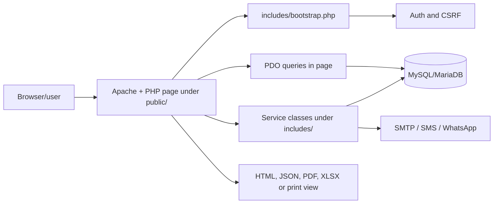
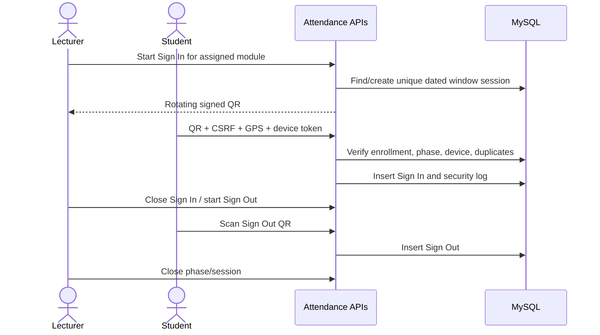
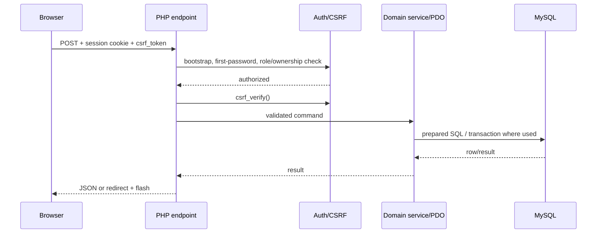
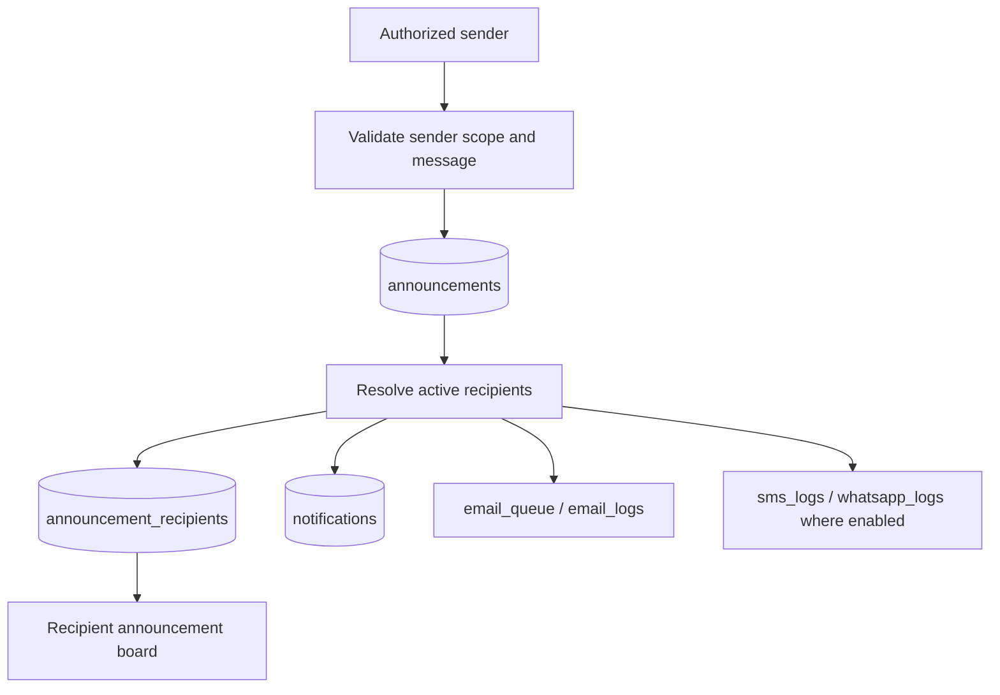

# SEMAS Technical Documentation

> Reverse-engineered from the PHP, SQL, JavaScript, templates, configuration, and dependency manifests in this repository. The database model is the cumulative result of `database/schema.sql` followed by migrations 002 through 031.

## 1. Project overview

SEMAS is a UNIVERSITY web information system for student accounts, academic modules, class and assessment attendance, CAT/exam eligibility, announcements, assignments, events, suggestions, reporting, and operational notifications.

### Registrar-controlled semester context

`Semester::active()` resolves the single current semester from `semester_calendars` where the current date is between `start_date` and `end_date`. Users never enter or select a semester. Migration 026 stores the resolved calendar ID automatically on modules, module enrollments, class sessions/logs, CAT/Exam schedules/logs, assignments, and academic events. New Registrar calendars cannot overlap, ensuring only one university semester is active.

Academic POST operations are rejected with HTTP 409 for APIs, or a user-facing flash message for pages, when no semester is active. This covers module management and registration, class and assessment attendance, CAT/Exam scheduling and eligibility, assignments, academic events, announcements, holidays, and attendance scanning. The shared layout displays the active semester globally, while active-semester reports are empty and PDF generation is rejected when no current semester exists.

The implementation addresses several related administrative problems:

- centralized student and staff account provisioning;
- audience-scoped institutional communication;
- module enrollment, assignment distribution, and submission;
- evidence-based class attendance using timed QR phases, GPS proximity, and device ownership;
- lecturer submission and HOD/Coordinator review of attendance;
- calculated CAT/exam eligibility and printable slips;
- invigilator-recorded CAT/exam attendance and evidence slips;
- event registration, capacity/waitlisting, signed QR check-in, and reminders;
- exports, audit history, settings, semester calendars, and database backup.

Implemented users are Principal, Dean, HOD, Coordinator, Lecturer, Registrar, and Student. “Administrator” appears only in the original seed schema; current protected pages and UI use `Principal`. This naming mismatch matters on an installation created only from the base schema.

At a high level, a browser requests a PHP page, `includes/bootstrap.php` initializes dependencies and the session, the page enforces its role, validates input/CSRF, calls a service or PDO directly, and renders Bootstrap HTML or returns JSON/export output.



## 2. Technologies used

| Technology | Actual use |
|---|---|
| PHP 8.2+ | Server pages, JSON APIs, business services, CLI/cron jobs, exports, and templates. Required by `composer.json`. |
| MySQL 8+ / MariaDB 10.4+ | Persistent relational database through PDO. The schema uses InnoDB, foreign keys, ENUMs, unique constraints, and `utf8mb4`. |
| PDO MySQL | Singleton connection in `includes/Database.php`; native prepared statements and exceptions are enabled. |
| HTML/CSS/JavaScript | Server-rendered UI plus Fetch/AJAX, camera scanning, geolocation, form interactions, and live attendance state. |
| Bootstrap 5 and Bootstrap Icons | Responsive layout, navigation, cards, tables, alerts, modals, badges, and icons; loaded from CDNs by the layout/auth partials. |
| Chart.js | Dashboard charts; loaded in `public/partials/layout_bottom.php`. |
| PHPMailer 6.9 | Authenticated SMTP HTML email in `includes/Mailer.php`. |
| Dompdf 2.x | Server-side PDF exports in Dean reports and attendance PDF endpoints. |
| PhpSpreadsheet 1.29 | XLSX exports for reports and class attendance sheets. |
| chillerlan/php-qrcode 6 | Composer QR dependency. Most current render paths use `includes/SimpleQr.php` or the package-backed QR data URI logic; QR payload security is implemented separately in `QrService`. |
| html5-qrcode 2.3.8 | Browser camera scanner loaded from unpkg on scanning pages, including assessment attendance. |
| OpenSSL PHP extension | AES-256-CBC QR/card payload encryption and decryption. |
| cURL PHP extension | HTTP calls to Twilio, Vonage, and Africa's Talking in `Sms.php`/`WhatsApp.php`. |
| Apache + mod_rewrite | Web server. `Dockerfile` points the document root at `public/` and adds clean-URL rewriting. |
| Docker | PHP 8.2 Apache image, required extensions, Composer install, document-root configuration, and runtime port entrypoint. |

There is no `package.json`, Node application, npm dependency, PHP framework, ORM, template engine, or JavaScript build step. There is no implemented AI service. `migration_020.sql` explicitly drops the retired `ai_notifications` table.

External services are SMTP, Twilio, Vonage, and Africa's Talking. No external calendar, maps, payment, cloud storage, or AI API is implemented.

## 3. System architecture

### Architectural style

The project is a front-controller-free, procedural multi-page PHP application with reusable static service classes:

- each URL maps to a physical PHP file;
- page files combine controller logic and view markup;
- domain/service classes live in `includes/`;
- PDO is used directly by both services and pages;
- email templates are PHP partials;
- layout partials provide the shared shell;
- API endpoints are ordinary PHP files returning JSON.

It is not MVC: there are no controller/model directories, router, middleware pipeline, dependency injection container, repositories, or ORM entities. `Auth::requireRole()` and `csrf_verify()` perform middleware-like work explicitly at each endpoint.

### Folder structure

| Path | Responsibility |
|---|---|
| `config/` | `.env` loader and constants. |
| `database/` | Base schema and ordered migrations. |
| `includes/` | Bootstrap, connection, authentication, services, calculators, helpers. |
| `public/auth/` | Login, logout, OTP, verification, password flows. |
| `public/admin/` | Principal functions plus Dean event/scanning pages retained under the historical folder name. |
| `public/hod/` | Academic module, holiday, attendance, submission, and eligibility management. |
| `public/coordinator/` | Weekend coordinator entry points; some delegate to HOD implementations. |
| `public/lecturer/` | Teaching, live attendance, assignments, announcements, and assessment attendance. |
| `public/registrar/` | Student provisioning/import and semester calendars. |
| `public/student/` | Modules, assignments, events, QR/scans, attendance, slips, suggestions. |
| `public/reports/` | Dean report view and PDF/XLSX exports. |
| `public/api/` | JSON endpoints for scans, live sessions, notifications, rooms, and lookup. |
| `public/partials/` | Shared authenticated/auth layouts and announcement card. |
| `templates/emails/` | HTML email templates and common email layout. |
| `cron/` | Scheduled event reminder task. |
| `scripts/` | Background email queue worker. |

### Request execution

1. Apache resolves a clean URL or `.php` path to a file under `public/`.
2. The file requires `includes/bootstrap.php`.
3. Composer autoload, configuration, and all service files are loaded.
4. `Auth::start()` opens the session and `Auth::enforceMustChangePassword()` may redirect.
5. A protected endpoint calls `requireRole()` or `requireTeachingAccess()`.
6. POST endpoints normally call `csrf_verify()`.
7. The page validates values, performs PDO/service operations, records selected audit events, and redirects with a flash message or renders output.

## 4. User roles and authorization

RBAC is code-based. `roles` stores names, but there is no permissions table. `public/admin/roles.php` is a display-only matrix and explicitly does not drive authorization.

| Role | Implemented access |
|---|---|
| Principal | System dashboard; staff/user management within page-specific rules; departments; settings; roles matrix; audit log; backup; suggestions; daily/weekly/monthly university-wide class and CAT/Exam attendance reports with student-register drill-down and latest-sitting headline metrics; system announcements; eligibility page. |
| Dean | University-wide student management in `admin/users.php`; events, participant lists, event QR/staff scan; announcements; suggestions; attendance reports and PDF/XLSX export. Migration comments and code state that Dean is no longer faculty-restricted. |
| HOD | Department-oriented modules, lecturers, schedules, enrollment, announcements, holidays, class attendance, attendance submissions, eligibility, attendance sheets/exports, account status actions, and suggestions. Scope checks are implemented inside individual pages. |
| Coordinator | Weekend-only academic authority through coordinator pages and shared HOD pages. Module actions call guards that require `session_type='Weekend'`. Has announcements, attendance, submissions, eligibility, and suggestions. |
| Lecturer | Only “teaching access”: assigned modules and/or assessment invigilation. Can run live class attendance, inspect attendance, create assignments, review/download submissions, announce to module students, and record/submit CAT/exam attendance. |
| Registrar | Registrar dashboard, student create/import/update operations, semester calendars, announcements, student-related suggestions. |
| Student | Student dashboard; profile; module discovery/enrollment; assignments/submission; events; event/class scans; attendance history; CAT/exam and evidence slips; personal QR/card; suggestions; scoped announcement board. |

HOD and Coordinator users may also access teaching pages if `Auth::canAccessTeaching()` finds a `lecturers` record with an ongoing assigned module or an invigilator assignment. The teaching menu is slightly stricter: it requires an ongoing module, not merely an invigilation assignment.

All authenticated roles can access the dashboard, profile, and announcement board. Role restrictions are server-side, not merely navigation hiding.

## 5. Authentication and account lifecycle

### Login

`public/auth/login.php` accepts email or registration number and password. `Auth::attempt()` joins `users` to `roles`, verifies `password_hash` with `password_verify()`, rejects Pending and Deactivated accounts, and returns the user. Successful login:

- regenerates the session ID;
- stores user ID, role, name, email, and first-login flag;
- updates `last_login_at`;
- writes a `LOGIN` audit event.

The login page supports a “use OTP” branch. `public/auth/login-otp.php` verifies a `login` OTP and then creates the normal session.

### Session handling

`Auth::start()` configures cookies as HttpOnly and SameSite=Lax. It does not explicitly set `Secure`, cookie lifetime, or strict session mode. Logout audits, clears session data, expires the cookie, and destroys the session.

### Passwords and temporary credentials

Passwords use `PASSWORD_BCRYPT`. Registrar-created students and provisioned staff receive generated/initial credentials and may have `must_change_password=1`. Bootstrap checks that flag from the database on every authenticated request and redirects to `auth/change-password.php` until cleared.

### Verification and reset

- Email verification: a 32-byte random hex token is stored as a hash in `email_verifications`; the URL carries the raw token. `verify-email.php` checks unused/unexpired rows, marks them verified, activates the user, and sets `email_verified_at`.
- Password reset link: `forgot-password.php` creates a hashed, expiring token in `password_resets` and emails the URL. `reset-password.php` checks expiry/use and updates the bcrypt hash.
- Password reset OTP: a parallel flow uses `Otp::issue()` and `Otp::verify()` with hashed codes, expiry, consumption, and attempt limits.
- Email change: `profile.php` creates `email_change_requests`; `confirm-email-change.php` verifies the token before replacing `users.email`.
- Resend verification and forgot-password responses avoid revealing whether an address exists.

Self-registration code remains in `public/auth/register.php`, but an unconditional redirect at the top makes it unreachable. Student provisioning is therefore Registrar-controlled in current behavior.

### Authorization

`Auth::requireRole()` checks an exact role-name allowlist. `requireTeachingAccess()` performs assignment-based access. More granular ownership/scope rules are written in pages and queries. This produces real server-side RBAC, but policy is distributed and can drift.

## 6. Database analysis

### Effective schema warning

`database/schema.sql` is not a current complete schema. A new deployment must apply every migration in numeric order. Some migrations use `ADD COLUMN IF NOT EXISTS`, while others do not; migration history is not stored in a migrations table.

### Tables

| Table | Purpose and important columns | Relationships, constraints, usage |
|---|---|---|
| `roles` | Role lookup: original Administrator/Dean/HOD/Student plus Lecturer, Registrar, Coordinator; code expects Principal. | `role_name` unique; referenced by `users`. |
| `faculties` | School name/code and optional dean. | Unique code; dean points to `users`; departments belong to a faculty. Dean scope is informational in current code. |
| `departments` | Department name/code, faculty, optional HOD. | Unique code; cascades when faculty deleted; HOD pointer set null on user deletion. |
| `users` | Identity, role, department, session/intake/year, registration number, contacts, bcrypt hash, photo, status, verification/login dates, opt-in, creator, first-password flag. | Unique email and registration number; role required; department/creator nullable FKs. Central entity for almost every feature. |
| `lecturers` | Lecturer-specific profile and department. | One-to-one unique `user_id`; referenced by modules and schedules. HOD/Coordinator teachers also need a row here. |
| `email_verifications` | Hashed account-verification tokens and lifecycle timestamps. | Cascades with user. |
| `password_resets` | Hashed reset tokens, expiry, and use timestamp. | Cascades with user. |
| `otp_codes` | Hashed OTP by purpose/channel with expiry, attempts, and consumption. | Cascades with user. |
| `email_change_requests` | Pending new email and hashed confirmation token. | Cascades with user. |
| `events` | Event details, coordinates, capacity/deadline/waitlist, date/times, creator, signed-QR secret/expiry/rotation, and lifecycle status. | Optional department; creator required. |
| `event_registrations` | Student/event registration state. | Unique event+user; Registered/Waitlisted/Cancelled; cascades on event/user deletion. |
| `attendance_logs` | Event check-in, method, confirmer, GPS reading, distance/device information. | Unique event+user prevents duplicate attendance; event/user cascade. |
| `event_reminders_sent` | 24h/1h/start delivery de-duplication. | Unique event+user+reminder type. |
| `announcements` | Content/category/priority/audience/scope, sender snapshot, draft/publish state, SMS/count metadata, optional event. | Posted by user; optional department/faculty/event. Current viewing is recipient-table based. |
| `announcement_recipients` | Materialized per-user audience. | Unique announcement+user; cascading FKs. |
| `notifications` | In-app bell item, category/read status, optional announcement. | User cascade; announcement set null. |
| `email_logs` | Synchronous/worker email outcome audit. | Optional user; Queued/Sent/Failed. |
| `email_queue` | Serialized template jobs with status, attempts, and process time. | Indexed by status+attempts; notably no declared user FK in its migration. |
| `sms_logs` | SMS requests/outcomes/provider. | Optional user; current provider ENUM includes Africa's Talking, Vonage, Twilio. |
| `whatsapp_logs` | WhatsApp result and error. | Optional user; Sent/Failed. |
| `audit_logs` | Actor, action, optional entity/details, IP, timestamp. | Optional user; Principal list UI. |
| `system_settings` | Key/value branding, academic, GPS, and behavior settings with updater. | Primary key is setting name. `Settings` supplies defaults/cache. |
| `suggestions` | Category/message, internal submitter, department, workflow/reply/resolution data. | UI deliberately omits submitter identity from staff projections. Later code expects resolution columns; these must exist in the live DB even though migration 002 shown here does not add all of them. |
| `rooms` | Room name/capacity and GPS center/radius. | Unique name; referenced by modules. |
| `modules` | Academic module, owner department, lecturer/invigilator, QR secret, session, room, CAT/exam dates, start/end, creator, status. | Department, lecturer, invigilator, creator, room FKs. Additional departments/intakes are join tables. |
| `module_departments` | Cross-cutting additional module departments. | Unique module+department. |
| `module_intakes` | Allowed intake cohorts such as JAN26/MAY26. | Unique module+intake. |
| `module_enrollments` | Student module registration. | Unique module+user. Used by attendance, assignments, announcements, schedules, and eligibility. |
| `assignments` | Module task, instructions, optional attachment, deadline, creator. | Cascades with module. |
| `assignment_submissions` | One uploaded response per assignment/student. | Unique assignment+user. |
| `class_sessions` | Dated module attendance window, start/end, secret, open/closed, live phase state, creator. | Unique module+date+window; phase is Inactive/SignIn/SignOut. |
| `class_attendance_logs` | Per-session per-student Sign In/Out, status, method, confirmer, IP/GPS/device. | Unique session+user+type, IP+type, and device+type constraints. `Auto` absent placeholders are distinguished from real QR/Manual entries. |
| `attendance_devices` | Hash ownership for one or more phones per student. | Device hash globally unique; indexed user. Reset metadata retained. |
| `attendance_security_logs` | Accepted/rejected scan security trail with actor/module/session/device/IP/GPS. | Nullable FKs preserve security events where possible. |
| `module_attendance_submissions` | Lecturer submission of CAT/Exam cutoff register; HOD/Coordinator decision. | Unique module+exam type; Pending/Approved/Rejected. |
| `cat_exam_eligibility` | Calculated absence/percentage metrics, system decision, reviewer state/final result. | Unique module+student+exam type. |
| `cat_exam_schedules` | One CAT or Exam sitting per module with date, times, room, invigilator. | Unique module+exam type. |
| `cat_exam_attendance_logs` | Invigilator-recorded assessment Sign In/Out, status, missed reason/notes. | Unique schedule+student+type. |
| `cat_exam_submissions` | Final invigilator submission of an assessment roster. | One row per schedule. |
| `holidays` | Public Holiday or Umuganda, optional replacement time windows. | Unique date; creator required. |
| `semester_calendars` | Academic year/intake semester dates and notes. | Unique year+intake; creator nullable. |

The schema is broadly third-normal-form: lookups and many-to-many associations are separated, delivery logs are independent, and duplicated announcement sender fields are an intentional historical snapshot. Deliberate denormalization also exists in eligibility metrics, module `room` plus `room_id`, announcement recipient counts, and stored sender fields.

### Main data flows

- Registrar/import → `users` → optional credentials email → student login/password change.
- HOD/Coordinator → `modules`, join tables, schedules → student enrollment → assignments and attendance.
- Attendance sessions → `class_attendance_logs` → submission → `cat_exam_eligibility` → HOD decision → student slip.
- Announcement creator → `announcements` → `announcement_recipients`, `notifications`, email/SMS delivery logs.
- Dean event → `events` → registrations/waitlist → QR attendance → report/reminder tables.

## 7. Module analysis

### User and organizational administration

`public/admin/users.php` supports role-dependent user listing and account operations. Principal handles staff/system users, Dean has broad student access, HOD is department-scoped, and Registrar provisions students. `public/registrar/students.php` supports individual creation and CSV import with validation/confirmation, assigns temporary credentials, and sends credential email. Departments/faculties are managed through `public/admin/departments.php`.

Validation includes required identity fields, unique email/registration number, recognized roles, scope checks, and student academic attributes. Account activation/deactivation sends templates and audit actions in relevant paths.

### Academic modules

`public/hod/modules.php` is the main management page; `public/coordinator/modules.php` and coordinator guards restrict changes to Weekend modules. A module has an owning department and optional cross-departments, one or more intakes, lecturer/invigilator, session type, room, lifecycle dates, and CAT/exam dates.

Room availability is application-enforced by queries for ongoing modules in the same session. Students see compatible ongoing modules in `public/student/modules.php`; enrollment requires department/cross-department, intake, and session compatibility. `UNIQUE(module_id,user_id)` handles races/duplicates.

### Assignments

Lecturers create assignments only for modules they teach, optionally upload an attachment, set a deadline, and notify enrolled students. Students see only assignments for enrolled modules and upload one submission. The implementation validates extension/type rules and deadline. Existing submissions are represented by the unique constraint and page logic; files are stored under `public/uploads/assignments`, not outside the web root. Lecturers list/download submissions.

### Suggestions

Authenticated users submit a categorized message. The submitter ID is stored but staff list/find methods deliberately do not project it; staff see only Student/Staff classification. Principal can see broader work; other staff are scoped. Replying removes an item from active staff queues while keeping it in the submitter’s private history. Status supports New, Replied, Resolved, Archived.

### Settings, audit, and backup

Principal can edit branding/academic/system settings. Mail/SMS credentials are displayed read-only because real secrets come from `.env`. The audit page filters/paginates `audit_logs`. Backup streams a pure-PHP SQL dump by enumerating tables and rows; it is an application-level logical export, not `mysqldump`.

### Semester calendars

Registrar creates or updates one semester calendar per academic year/intake. Date validation requires a coherent range. Matching active students are emailed using the semester template.

## 8. Attendance logic

There are three distinct attendance systems.

### A. Event attendance

1. Dean creates an event with a random `events.qr_secret`.
2. `admin/qr.php`/`api/qr-refresh.php` generates a short-lived `E:event_id:exp:nonce:hmac` token.
3. Student scans through `student/scan.php`; `api/checkin.php` loads the event and calls `QrService::verifyPayload()`.
4. Event status/date/expiry and GPS proximity are checked.
5. Existing event+student attendance is rejected; the database unique key is the race-safe guarantee.
6. A row is inserted with QR, coordinates, distance, GPS result, and device information.
7. An in-app/email attendance confirmation is sent.

Dean staff-scan endpoints preview a student QR/card and then insert `StaffScan` attendance with `confirmed_by`. Manual is represented in the schema but no broad event-manual workflow was found beyond staff scan.

### B. Class attendance

Current class attendance uses lecturer-controlled live phases in `public/lecturer/live-session.php`, `public/api/lecturer-session-qr.php`, and `public/api/student-attendance-scan.php`.

`ClassAttendance::currentWindow()` resolves fixed Africa/Kigali schedule windows for Day, Evening, Weekend morning/afternoon, and Umuganda overrides. Public holidays suppress expected classes; Umuganda can replace weekend windows. Module start/end dates and module session type must match.

The lecturer:

- selects an assigned ongoing module;
- starts Sign In, which finds/creates the unique module/date/window session;
- displays a rotating, HMAC-protected QR tied to the current session/phase;
- may profile-verify and manually mark an enrolled student while the phase is active;
- closes Sign In, starts Sign Out, then closes the session.

The student scan endpoint:

- requires Student role, CSRF, an active enrolled module, and a valid current phase;
- validates rotating token, session/module/date/window, and module QR secret;
- obtains/validates a persistent client device token and SHA-256 device ownership;
- prevents one device from belonging to different students;
- checks room coordinates/radius when configured, falling back to campus GPS settings;
- logs security failures in `attendance_security_logs`;
- enforces one user/IP/device record per attendance type through both code and unique indexes;
- classifies Sign In relative to scheduled start and records Sign Out;
- allows manual Sign Out only in the narrow end-to-10-minutes-after window; Sign In always requires QR;
- generates warning notifications/email/SMS on the third and later effective absence.

`AttendanceSheet::ensurePastSessions()` creates closed sessions and `Auto` Absent placeholders for expected past class dates that had no session/log rows. `decisionForLogs()` treats a real sign-in/sign-out pair as full attendance and differentiates late/left-early/missing events. Auto placeholders must not be counted as real presence.

Older `public/lecturer/class-attendance.php` now immediately redirects to `live-session.php`; most of the old file remains unreachable dead code.

### C. CAT/exam attendance

HOD/Coordinator schedules an assessment with room, times, and invigilator. The assigned invigilator uses `lecturer/cat-exam-attendance.php` and `api/cat-exam-attendance-confirm.php` to:

- search/scan and preview an enrolled eligible student;
- record Sign In;
- prevent early Sign Out during the first hour and reject actions outside the sitting;
- record Sign Out;
- capture a reason (Cheating, Sickness, Other) for signed-in students lacking sign-out;
- submit the final roster once; subsequent edits are blocked.

Both sign-in and sign-out are required for the student’s assessment evidence slip.

### Eligibility calculation

`includes/Eligibility.php` and `AttendanceSheet` derive metrics from expected class dates/sessions before the CAT or Exam cutoff:

- total qualifying sessions;
- present, late, left-early, and absence counts;
- attendance percentage;
- system Allowed/Not Allowed result.

The implemented formula is explicit: both Sign In and Sign Out are Present; Sign Out without Sign In is Late; missing both, or Sign In without Sign Out, is Absent; every two Late days add one effective absence. CAT counts module start through the day before CAT. Exam starts after CAT and runs through the day before Exam. Assessment dates and configured holidays are excluded. Zero through two effective missed days is Allowed, and three or more is Not Allowed. When the lecturer closes Sign Out, the system immediately queues a warning email the first time a student reaches two effective missed days in that module; it does not wait for CAT/Exam eligibility generation. At four pre-CAT effective absences the student is automatically de-registered, their eligibility row is removed, and a permanent block prevents re-registration to that same module while retaining attendance evidence. While the disciplinary module remains Ongoing, every registration route also blocks the student from joining another module; that cross-module suspension ends when the disciplinary module becomes Completed.

Generation is connected to formal lecturer attendance submission. The HOD/Coordinator approves or rejects that submission. Rejection unlocks the lecturer for corrections/resubmission. Eligibility rows have system, HOD, and final decisions; reviewers may approve or override with a reason. Student CAT/exam slip pages expose final allowed results for ongoing/enrolled modules and scheduled assessments.

The exact weighting/threshold constants are defined in `Eligibility::metricsForStudent()` and the decision methods; consumers should call this service instead of duplicating calculations. Some older attendance pages still contain duplicated aggregation logic, creating drift risk.

### Attendance reports

- Lecturer/HOD attendance screen: per-session roster and overall module/student analytics.
- Printable attendance sheet: date columns and decisions.
- XLSX attendance sheet: same matrix via PhpSpreadsheet.
- Attendance PDF: daily/monthly/range filtering via Dompdf.
- Principal module report: module completion/attendance history.
- Dean event reports: event totals and attendee detail via common report query.

## 9. Announcement system

Announcements can be created by Principal, Dean, HOD/Coordinator, Lecturer, and Registrar through separate role-specific pages. They share `Announcement`, `AudienceResolver`, notification, email, and delivery services, but some pages perform their own recipient queries for special scopes.

Implemented audiences include All/First Year/Final Year Students, Specific Department, Specific Faculty, Day/Evening/Weekend Students, Event Participants, Staff, All Staff, Registrar, Coordinator, University Community, Department Lecturers, and Module Students.

Creation stores:

- category and priority;
- audience and optional department/faculty/event scope;
- message;
- author plus immutable sender name/role/scope snapshot;
- Draft/Published state, recipient count, and SMS flag.

For a published announcement, recipients are resolved from active accounts, persisted in `announcement_recipients`, given in-app notifications, and sent channel notifications as configured. The board queries recipient rows, preventing users from seeing messages merely because an audience label happens to match later. `Announcement::backfillForNewStudent()` adds still-relevant prior announcements for newly created students. `purgeExpired()` removes expired content according to service rules.

Scheduling for arbitrary future publication is not implemented. `posted_at` records publication/creation time, and Draft exists, but there is no `publish_at` field or scheduler. “Scheduling” exists for event reminders and semester/exam dates, not announcements.

## 10. Event management

Dean owns the implemented event module:

- create/edit event details, venue coordinates, date/times, capacity, deadline, waitlist setting, and QR settings;
- move among Scheduled/Ongoing/Completed/Cancelled states;
- view participants;
- display/rotate signed event QR;
- scan a student/card as staff;
- view/export event attendance reports.

Students list events and register/cancel. Registration:

- rejects closed deadlines and cancelled/completed conditions;
- uses Registered while capacity exists;
- uses Waitlisted only when enabled and capacity is full;
- prevents duplicate active registrations through the unique row and status logic;
- promotes the next waitlisted participant when a registered participant cancels;
- sends registration confirmation.

There is no separate event approval entity or approval workflow. Event “approval” is therefore **not implemented**. Dean creates and manages events directly. Venue is a string plus optional coordinates; it is not linked to `rooms`.

## 11. Notification engine

### In-app notifications

`NotificationCenter` creates, lists, counts, and marks `notifications` rows. `public/api/notifications.php` supports unread fetch/mark actions for the layout bell. Categories are Event, Announcement, Attendance, and System.

### Email

`Mailer` renders PHP templates, records logs, and either sends through PHPMailer SMTP or queues work. `email_queue` holds serialized template variables. `scripts/process-email-queue.php` invokes `Mailer::processQueue()`, which claims pending rows, limits attempts, sends, and marks sent/failed.

`Mailer::dispatch()` starts the CLI worker non-blockingly where supported. Reliable production operation should also schedule the worker because a web-spawned process is environment-dependent.

### Event cron

`cron/send_reminders.php` finds Scheduled/Ongoing events near the 24-hour, 1-hour, and start thresholds. For each Registered participant it checks `event_reminders_sent`, creates a notification, sends email, and writes the de-dup row. Waitlisted/cancelled users are excluded.

### SMS and WhatsApp

`Sms::send()` supports Twilio, Vonage, and Africa's Talking based on configuration and writes `sms_logs`. `WhatsApp` supports configured Twilio/Vonage delivery and logs outcomes. Announcement/attendance paths call these selectively. Event reminder cron sends bell+email, not SMS.

There is no general-purpose durable notification queue spanning all channels, no exponential backoff, no dead-letter table, and no webhook-based provider status reconciliation. Email has bounded attempts; SMS/WhatsApp calls are immediate.

## 12. Reports and exports

| Report | Implementation |
|---|---|
| Dean event report | `reports/index.php`, `ReportScope`, and `ReportQuery`; filters events/attendance in Dean scope (currently university-wide), shows summary and rows. |
| Dean PDF | `reports/export-pdf.php`; reuses report query and renders with Dompdf. |
| Dean Excel | `reports/export-excel.php`; reuses report query and writes XLSX. |
| Principal module reports | `admin/module-reports.php`; module filters, counts, and history. |
| HOD/Coordinator class attendance | `hod/class-attendance.php`; student/module/session summaries and warning categories. |
| Lecturer attendance | Current operational view is live-session; old analytics code remains behind a redirect. |
| Attendance sheet print | Role-specific print endpoints use `AttendanceSheet` for expected dates and decisions. |
| Attendance sheet XLSX | Role-specific PhpSpreadsheet endpoints. |
| Attendance PDF | Role-specific Dompdf endpoints with date range types. |
| CAT/exam eligibility | HOD eligibility page and student print slips; calculated/stored metrics and final decision. |
| CAT/exam evidence | Student evidence slip verifies paired invigilator sign-in/out. |
| Dashboard analytics | SQL aggregates and Chart.js for users, status, modules, attendance, registrations, and role-specific summaries. |
| Backup | Principal SQL logical dump, not an analytical report. |

Print slips use HTML/CSS and `window.print()` where a server PDF is unnecessary. Slip QR values include a signed online verification URL and scanner-readable offline text.

## 13. APIs

These are internal HTTP endpoints, not a versioned public REST API:

| Endpoint | Purpose |
|---|---|
| `api/checkin.php` | Student event QR/GPS check-in. |
| `api/qr-refresh.php` | Dean event QR rotation. |
| `api/admin-scan-preview.php`, `admin-scan-confirm.php` | Dean student/card preview and event staff check-in. |
| `api/lecturer-session-qr.php` | Start/close attendance phases, state, rotating QR, manual marking. |
| `api/student-attendance-scan.php` | Student class sign-in/out and security enforcement. |
| `api/class-session-live.php` | Live roster/state polling. |
| `api/class-scan-preview.php`, `class-scan-confirm.php` | Teaching staff student preview/manual/card confirmation. |
| `api/class-checkin.php` | Legacy class token check-in path; current live flow centers on `student-attendance-scan.php`. |
| `api/cat-exam-attendance-confirm.php` | Assessment lookup, sign-in/out, roster, reasons, final submission. |
| `api/student-lookup.php` | Scoped student profile lookup. |
| `api/available-rooms.php` | Session-aware room choices. |
| `api/notifications.php` | Bell retrieval and read updates. |

Authentication is the PHP session cookie. Mutating POSTs use the session CSRF token. Responses are JSON and generally include `ok` and `message`. Failure handling uses HTTP status codes inconsistently; many business failures are JSON responses on 200.

External API calls use HTTP Basic/token credentials in configuration, JSON/form payloads depending on provider, cURL timeouts, and provider-specific success parsing. Failures are recorded rather than retried centrally.

## 14. Security analysis

### Implemented controls

- Native PDO prepared statements are standard for user-controlled values.
- `e()` escapes output with `ENT_QUOTES`/UTF-8; templates generally use it or `htmlspecialchars`.
- Session IDs regenerate at login.
- Session cookies are HttpOnly and SameSite=Lax.
- CSRF uses a 32-byte random session token and `hash_equals`.
- Passwords, OTPs, verification tokens, and reset tokens are stored hashed.
- QR tokens use random secrets, expiry, HMAC, and for older/session formats AES-256-CBC.
- Database unique constraints protect duplicate attendance/enrollment/submission races.
- Role and teaching-access checks run server-side.
- Scope/ownership checks exist in academic and user-management pages.
- GPS, room radius, device ownership, IP/device de-duplication, and security logs harden class attendance.
- Upload extensions/types and deadlines are checked in assignment paths.
- Audit logging exists for important authentication and administration actions.

### Security weaknesses and recommendations

1. **Uploaded files are web-accessible.** Assignment/profile uploads live under `public/uploads`. Store uploads outside the document root and serve them through an authorized download controller; generate server-side names and add malware/content scanning.
2. **Session cookie hardening is incomplete.** Set `secure=true` under HTTPS, use strict mode, define an idle/absolute timeout, and consider SameSite=Strict where compatible.
3. **No login throttling.** Password login has no per-IP/account rate limit or lockout. Add bounded throttling and audit failed attempts.
4. **Distributed authorization.** Ownership checks are repeated in pages. Centralize policies so a newly added endpoint cannot omit scope validation.
5. **Environment fallback risk.** `APP_KEY` defaults empty and local mode displays errors. Production deployment must fail closed when secrets are absent and force `APP_ENV=production`.
6. **CSP/SRI absent.** Multiple CDN scripts/styles are trusted without a Content-Security-Policy or integrity pins.
7. **QR signatures are truncated.** Event compact HMAC uses 80 bits. This is likely adequate against casual forgery but full-length or at least 128-bit tags are preferable.
8. **GPS is client-supplied.** Browser geolocation can be spoofed; it is a deterrent, not proof of physical presence.
9. **Device identity is client-persisted.** It can be cleared/copied. The global hash ownership rule improves abuse resistance but is not hardware attestation.
10. **Backup exposes all data.** The Principal backup endpoint should require re-authentication, strong audit, HTTPS, and ideally encrypted output/retention controls.

## 15. QR code and slip security

### Event QR

`QrService::buildPayload()` creates `E:id:exp:nonce:hmac`, with HMAC-SHA256 truncated to 20 hex characters. Verification uses the event’s stored secret, constant-time signature comparison, and expiry. The verifier retains backward compatibility with a three-part AES-CBC+HMAC token.

### Class QR

Session payload helpers encrypt JSON containing session ID, expiry, and nonce with AES-256-CBC and authenticate IV+ciphertext with HMAC-SHA256. The current live flow additionally uses module/session/phase-bound rotating tokens in `lecturer-session-qr.php` and validates current phase, time, module, device, and GPS in `student-attendance-scan.php`.

### Student/card QR

Student QR/card payloads are encrypted/signed with `APP_KEY`-derived material and parsed by preview endpoints. Plain university card text has a fallback parsing path for assessment scanning; it is validated against a user record and expiry/card rules rather than blindly trusted.

### Slips

`SlipVerification` creates compact offline text/data plus a signed online verification link. `public/verify-slip.php` validates token signature and reloads current database facts. This prevents simple URL field alteration, but authenticity ultimately depends on keeping `APP_KEY` secret.

Duplicate detection is primarily database-backed: event/user, session/user/type, session/device/type, and schedule/user/type unique indexes.

## 16. Email system

SMTP settings are read from `.env`: host, port, encryption, username/password, sender address/name. PHPMailer uses authenticated SMTP and HTML templates.

Templates cover verification, registration, OTP, password reset/change, account activation/deactivation, staff/student credentials, announcement, assignment, event registration/reminder, attendance confirmation/warning, semester calendar, invigilator assignment, CAT/exam schedule, and eligibility decision.

The mailer:

- renders templates with variables;
- sends HTML with a text fallback;
- logs recipient, subject, template, status, error, and time;
- can queue jobs and process them asynchronously;
- catches provider exceptions and records failure.

There is no inbound/bounce handling, delivery webhook, attachment queue format, unsubscribe center, or suppression list. `sms_opt_in` exists, but there is no equivalent generalized email preference.

## 17. Frontend

`layout_top.php` builds the authenticated sidebar/topbar from role and teaching access. `layout_bottom.php` closes the layout, loads Bootstrap JavaScript/Chart.js, renders notifications, and contains common behavior. Auth pages use smaller `auth_top.php`/`auth_bottom.php` wrappers.

The UI is Bootstrap-based and responsive, with cards, tables, off-canvas/sidebar navigation, modals, badges, alerts, tabs, and print CSS. `public/assets/css/style.css` provides branding and component overrides.

JavaScript is embedded per page rather than bundled:

- Fetch with URL-encoded POST for JSON APIs;
- polling of live attendance state/roster;
- `navigator.geolocation`;
- camera scanning with html5-qrcode;
- browser device-token persistence;
- Bootstrap modal control;
- Chart.js dashboard visualizations;
- print invocation and form-dependent controls.

There is no frontend framework, TypeScript, module bundler, lint configuration, automated browser test suite, or service worker.

## 18. Backend services

| Service/helper | Responsibility |
|---|---|
| `Database` | Singleton/reconnectable PDO connection. |
| `Auth` | Login, sessions, user/role access, first-password enforcement, teaching capability. |
| `AuditLog` | Append-only audit entries. |
| `Otp` | Issue and verify bounded, expiring, hashed OTPs. |
| `Settings` | Cached key/value settings and defaults. |
| `Mailer`, `Sms`, `WhatsApp`, `Delivery` | Channel delivery, templates, provider calls, and logs. |
| `NotificationCenter`, `NotificationGenerator` | In-app notification CRUD and generated notifications. |
| `AudienceResolver`, `Announcement` | Audience selection, sender snapshot, recipient materialization, distribution, rendering/backfill. |
| `QrService`, `SimpleQr`, `SlipVerification` | Payload security, QR image generation, and offline/online slip verification content. |
| `GpsService` | Haversine distance and allowed-radius checks. |
| `ClassAttendance`, `AttendanceSheet` | Time windows/holidays/sessions and attendance matrices/decisions. |
| `Eligibility` | Attendance metric and CAT/exam decision generation. |
| `Module`, `IntakeHelper` | Module lifecycle/helpers and year-coded intake normalization/matching. |
| `ReportQuery`, `ReportScope` | Shared Dean report filters/data/scope. |
| `Suggestion` | Privacy-preserving suggestion workflow projections. |

The service layer is useful but incomplete: large pages still own validation, SQL, business rules, and rendering.

## 19. Complete user workflows

### Student provisioning and first login

1. Registrar creates/imports student.
2. System validates identity, registration number, department/session/year/intake, and uniqueness.
3. Active account with bcrypt temporary password is inserted; first-change flag is set.
4. Credentials email is queued/sent.
5. Student logs in using email or registration number.
6. Bootstrap forces password change.
7. Student chooses a new bcrypt password and proceeds to dashboard.

Self-registration and its email verification code exist but are unreachable in current routing behavior.

### Password reset

1. User submits email.
2. System responds generically.
3. If eligible, it creates either a hashed URL token or OTP with expiry.
4. Email is sent.
5. User presents the secret; server hashes/verifies, checks unused/unexpired/attempts.
6. Password is replaced and token consumed; change notification is sent.

### Module enrollment

1. HOD/Coordinator creates ongoing module, lecturer, room, dates, departments/intakes/session.
2. Student opens compatible modules.
3. Server validates ongoing state and academic scope.
4. Enrollment is inserted; duplicate unique constraint prevents repeats.
5. Enrollment controls assignments, attendance roster, announcements, eligibility, and assessment lists.

### Assignment

1. Assigned lecturer creates task/deadline/optional file.
2. Enrolled students receive notification/email.
3. Student downloads details and uploads permitted file before deadline.
4. One submission row per assignment/student is stored.
5. Lecturer lists and downloads scoped submissions.

### Live class attendance



### Attendance submission and eligibility

1. Expected dates and real/Auto attendance decisions are calculated up to CAT/Exam cutoff.
2. Lecturer submits module attendance for that assessment type.
3. Covered attendance is locked and eligibility rows are generated.
4. HOD/Coordinator approves submission or rejects with note.
5. Reviewer accepts system eligibility or overrides with reason.
6. Student receives decision and, when Allowed/scheduled, prints slip.

### CAT/exam attendance

1. HOD schedules sitting and invigilator.
2. Invigilator opens assigned sitting.
3. Student is searched/scanned and eligibility/profile previewed.
4. Invigilator records Sign In and later Sign Out; early departure is restricted.
5. Missing sign-outs receive reasons.
6. Invigilator submits immutable roster.
7. Student with both records can print an evidence slip.

### Announcement

1. Authorized sender chooses content and allowed scope.
2. Server resolves active recipients under sender scope.
3. Announcement and immutable sender snapshot are saved.
4. Recipient join rows and in-app notifications are created.
5. Email/SMS/WhatsApp is attempted where wired/configured.
6. Recipient reads the scoped board/bell.

### Event

1. Dean creates event and QR secret.
2. Student registers; capacity chooses Registered or Waitlisted.
3. Confirmation is delivered.
4. Cron sends de-duplicated reminders.
5. At event, student self-scans signed QR with GPS or Dean staff-scans card.
6. Unique attendance is stored and reported.
7. Cancellation can promote first waitlisted registration.

### Suggestion

1. User submits category/message.
2. Identity is stored internally, omitted from staff-facing queries.
3. Authorized staff reviews scoped work queue and replies/resolves.
4. Item disappears from staff active queue after reply.
5. Submitter sees reply/status in private history.

## 20. Implemented business rules

- Only Active users can log in and receive resolved audience delivery.
- First-login temporary passwords must be changed before other protected pages.
- Role names and assignment ownership determine page/API access.
- Coordinator academic changes are Weekend-only.
- Student module enrollment must match module status, department/cross-department, session, and intake.
- One enrollment per student/module and one submission per student/assignment.
- Assignment submission is deadline- and file-rule-bound.
- One event registration row per student/event; capacity and deadline govern Registered/Waitlisted.
- Cancelled/waitlisted users do not receive event reminders; each reminder stage sends once.
- One event attendance row per student/event.
- QR payloads must authenticate and be unexpired.
- Event/class GPS must pass configured radius when required.
- A class device hash is exclusive to one student; multiple devices per student are allowed after migration 023.
- One class Sign In/Out per user, IP, and device per session/type.
- Class attendance is accepted only for an ongoing enrolled module within date/window/active phase.
- Sign In requires QR; manual student Sign Out is limited to class end through ten minutes afterward.
- Public holidays do not count as class days; Umuganda may use override windows.
- Auto Absent placeholders are not real attendance.
- Assessment attendance is invigilator-controlled, time-bound, and one Sign In/Out per student.
- Assessment sign-out during the first hour is blocked.
- Submitted assessment rosters and accepted attendance submissions become locked.
- Eligibility override requires reviewer action and reason.
- Announcement visibility is based on persisted recipient membership.
- Suggestion submitter identity is intentionally excluded from staff projections.

## 21. Major system sequences

### Generic protected POST



### Announcement delivery



## 22. File-by-file guide

### Root/config/database

- `index.php`, `public/index.php`: redirect entry points.
- `composer.json`: PHP/runtime library contract and classmap.
- `Dockerfile`, `docker-entrypoint.sh`: Apache/PHP container, extensions, Composer, document root, rewrite, runtime port.
- `config/config.php`: simple `.env` parser, constants, timezone/error mode.
- `database/schema.sql`: original base schema and seed; incomplete without migrations.
- `database/migration_002.sql`–`023.sql`: cumulative product evolution. Migrations 018/019 repair attendance data/indexes; 020 removes retired tables; 022/023 define current live phases/multi-device behavior.

### Includes

Every file under `includes/` is summarized in the Backend services table. `bootstrap.php` is the critical include that eagerly loads all services and starts/enforces authentication state.

### Authentication pages

- `login.php`, `login-otp.php`, `logout.php`: password/OTP sessions.
- `forgot-password.php`, `reset-password.php`, `reset-password-otp.php`: recovery.
- `verify-email.php`, `resend-verification.php`: verification lifecycle.
- `change-password.php`: voluntary/forced password update.
- `confirm-email-change.php`: new-address confirmation.
- `register.php`: retained but disabled self-registration implementation.

### Shared/public shell

- `dashboard.php`: role-branching aggregate dashboard.
- `profile.php`: profile/photo/contact/email change.
- `announcements/board.php`: persisted-recipient board.
- `partials/layout_top.php`, `layout_bottom.php`: authenticated shell/navigation/assets/notifications.
- `partials/auth_top.php`, `auth_bottom.php`: auth shell.
- `partials/announcement_card.php`: common announcement rendering.
- `assets/css/style.css`: application styling.

### Principal/admin

- `admin/users.php`: multi-role user administration.
- `admin/departments.php`: organizational units.
- `admin/settings.php`: branding/academic/system settings.
- `admin/announcements.php`: Principal delivery.
- `admin/suggestions.php`: shared staff suggestion work queue.
- `admin/audit-log.php`: searchable audit list.
- `admin/module-reports.php`: cross-module summaries/history.
- `admin/roles.php`: static permissions documentation, not enforcement.
- `admin/backup-download.php`: logical SQL dump.

### Dean events/reporting

- `admin/events.php`: event CRUD/state/registration configuration.
- `admin/event-participants.php`: registration/waitlist participant view.
- `admin/qr.php`: event QR display.
- `admin/scan-student.php`: staff scanner UI.
- `dean/announcements.php`: Dean announcements.
- `reports/index.php`, `export-pdf.php`, `export-excel.php`: event reports.
- corresponding `api/admin-scan-*`, `api/checkin.php`, `api/qr-refresh.php`: event attendance.

### Academic authority

- `hod/modules.php`: core module/schedule/enrollment/lecturer operations.
- `coordinator/modules.php`: Weekend coordinator route/workflow.
- `hod/class-attendance.php`: HOD/Coordinator analytics/manual administration.
- `hod/attendance-sheet-print.php`, `attendance-sheet-excel.php`, `attendance-pdf.php`: exports.
- `hod/cat-exam-submissions.php`: assessment submission review.
- `hod/eligibility.php`: generation/approval/override.
- `hod/holidays.php`: holiday windows.
- `hod/module-qr-print.php`: persistent classroom module QR print.
- `hod/announcements.php`, `coordinator/announcements.php`: scoped messaging.
- `hod/toggle-status.php`: department account status action.
- `coordinator/dashboard.php`, `eligibility.php`: coordinator entry points.

### Teaching

- `lecturer/modules.php`: assigned modules/current schedules.
- `lecturer/live-session.php`: current class attendance control and roster.
- `lecturer/class-attendance.php`: redirect plus unreachable legacy implementation.
- `lecturer/assignments.php`, `assignment-submissions.php`, `assignment-download.php`: assignment lifecycle.
- `lecturer/announcements.php`: module-student messages.
- `lecturer/cat-exam-attendance.php`: invigilation UI.
- attendance print/XLSX/PDF endpoints: scoped exports.
- `api/lecturer-session-qr.php`, `student-attendance-scan.php`, `class-session-live.php`: current live engine.
- `api/class-scan-preview.php`, `class-scan-confirm.php`: teaching staff preview/confirmation.
- `api/cat-exam-attendance-confirm.php`: invigilator command endpoint.

### Registrar/student

- `registrar/students.php`: create/import/edit student accounts.
- `registrar/semester-calendar.php`: calendar CRUD and email.
- `registrar/dashboard.php`, `announcements.php`: Registrar overview/messaging.
- `student/modules.php`: compatible modules/enrollment.
- `student/assignments.php`: task list/upload.
- `student/events.php`: registration/waitlist/cancellation.
- `student/attendance.php`: class attendance history/metrics.
- `student/class-scan.php`: lightweight bridge to current scanning UI.
- `student/scan.php`: event scanner.
- `student/my-qr.php`: student identity/card QR.
- `student/cat-exam-slips.php`, `slip.php`, `slip-print.php`: eligibility slips.
- `student/evidence-slip.php`: assessment attendance evidence.
- `student/suggestions.php`: submitter workflow.
- `verify-slip.php`: public signed verification landing page.

### Jobs/templates

- `cron/send_reminders.php`: event-stage scheduler.
- `scripts/process-email-queue.php`: queued email worker.
- `templates/emails/*.php`: channel-specific HTML bodies using `_layout.php`.

## 23. Missing, incomplete, unused, and technical debt

- The base schema still requires numbered migrations; `scripts/migrate.php` now applies and records them.
- There is no rollback strategy or transactional cross-migration recovery.
- `scripts/system-check.php` provides syntax, schema, asset, duplicate-attendance, stale-event, and SQL-pattern checks; there is still no unit/browser test suite or code coverage configuration.
- Event approval workflow is not implemented.
- Future announcement scheduling is not implemented.
- No AI integration; retired AI table is dropped.
- Poll and lost-and-found features are explicitly retired/dropped.
- Student self-registration implementation is unreachable.
- `lecturer/class-attendance.php` is an authenticated compatibility redirect to the live attendance screen.
- `api/class-checkin.php` represents an older class-check-in route and is secondary to the current live phase engine.
- Composer QR dependency and custom `SimpleQr` overlap.
- `modules.room` and `modules.room_id` duplicate room identity for backward compatibility.
- Business rules and SQL are duplicated between large HOD/Lecturer pages and services.
- Email queue worker spawning is not a substitute for a supervised queue process.
- SMS/WhatsApp lack durable retry and delivery-status reconciliation.
- No event venue entity, event approval, attendance correction workflow, or generalized calendar integration.
- No database-enforced check constraints for date/time ordering, positive capacities, or scope compatibility.

## 24. Bugs and risks found

### High priority

1. **Fresh installs require migrations:** run `scripts/migrate.php` after the base schema; the runner records applied files in `schema_migrations`.
2. **Profile/branding images remain web-served:** executable upload types are denied. Assignment files are denied direct access and use authorized download controllers.

### Medium priority

6. **Authorization policy duplication:** scope predicates are embedded in pages, raising horizontal-access regression risk.
7. **Database migrations are not uniformly idempotent:** reruns can fail on unguarded ALTERs; failed partial application has no transaction/version record.
8. **N+1 and repeated aggregates:** dashboard, audience delivery, attendance analytics, and email loops execute many per-user/per-module queries.
9. **Email worker supervision:** row claims are checked and failed messages retry up to five attempts, but production still needs a supervised worker.
10. **Client-provided GPS/device trust:** both are spoofable and should not be described operationally as proof.
11. **Static role matrix can become false documentation:** it is manually maintained separately from guards.

### Lower priority/UI/edge cases

- Long-running mass email operations may exceed worker/runtime/provider limits.
- CSV import and large report pages can consume substantial memory.
- Frontend and QR-scanner libraries are vendored locally; optional remote avatar fallbacks may still be unavailable offline.
- Event status is partly manual; stale Scheduled/Ongoing states can affect UI.
- Many JSON APIs use application errors without consistent 4xx status codes.
- Error display in local mode may reveal SQL/path details.

## 25. Performance analysis

### Current strengths

- Unique indexes cover major duplicate keys.
- PDO native prepares avoid repeated parse/security problems.
- Report export view/PDF/XLSX share query helpers in the Dean report module.
- Email can be queued.
- Lists such as audit/announcement board use pagination/limits.

### Optimization opportunities

1. Add indexes for common filters not guaranteed by current schema: `users(status,role_id,department_id,session_type,intake)`, event date/status, announcement posted/status, module status/session/dates, class session module/date/status, attendance user/time, schedules date/invigilator.
2. Replace per-recipient notification/email inserts with batched insert operations where audit semantics permit.
3. Pre-aggregate dashboard metrics or combine scalar count queries.
4. Move attendance calculation into one canonical query/service and reuse cached/precomputed eligibility rows.
5. Stream large CSV/XLSX/report results and paginate operational tables.
6. Add queue locking (`SELECT ... FOR UPDATE SKIP LOCKED` or atomic status update), supervised workers, and chunked batches.
7. Avoid loading every service on every request; Composer autoload classes on demand.
8. Cache stable settings, roles, departments, and room lists with explicit invalidation.
9. Add slow-query logging and `EXPLAIN` checks for attendance/report queries on production-sized data.

## 26. Developer guide

### Requirements

- PHP 8.2+ with PDO MySQL, mbstring, OpenSSL, cURL, GD, XML, ZIP, and fileinfo;
- MySQL 8+ or compatible MariaDB;
- Composer;
- Apache with rewrite enabled;
- SMTP and optional SMS/WhatsApp provider credentials;
- HTTPS in production.

### Installation

1. Clone/copy the project with the web document root set to `public/`.
2. Run `composer install --no-dev --optimize-autoloader` for production.
3. Create the database by applying `database/schema.sql`.
4. Apply `migration_002.sql` through `migration_023.sql` in exact numeric order.
5. Before relying on the installation, resolve the Principal role and add the suggestion resolution columns through a real migration rather than runtime DDL.
6. Create `.env` in the project root.
7. Provision the first Principal through a trusted database/bootstrap procedure; no default password is seeded.
8. Ensure upload directories are writable, then preferably relocate them outside the public root.
9. Configure Apache rewrite/document root or use the supplied Docker image.

### Environment variables

| Variable group | Keys |
|---|---|
| Database | `DB_HOST`, `DB_PORT`, `DB_NAME`, `DB_USER`, `DB_PASS` |
| Application | `APP_URL`, `APP_ENV`, `APP_KEY` |
| SMTP | `MAIL_HOST`, `MAIL_PORT`, `MAIL_ENCRYPTION`, `MAIL_USERNAME`, `MAIL_PASSWORD`, `MAIL_FROM_ADDRESS`, `MAIL_FROM_NAME` |
| Twilio | `TWILIO_SID`, `TWILIO_TOKEN`, `TWILIO_FROM_NUMBER`, `TWILIO_WHATSAPP_FROM` |
| Vonage | `VONAGE_API_KEY`, `VONAGE_API_SECRET`, `VONAGE_FROM`, `VONAGE_WHATSAPP_FROM` |
| Africa's Talking | `AT_USERNAME`, `AT_API_KEY`, `AT_SHORTCODE` |
| Provider choice | `SMS_PROVIDER` |

Use a random 32-byte-or-longer `APP_KEY`; never retain the empty default. `APP_URL` must point at the externally reachable public root for links and QR verification.

### Local run

With XAMPP, place the project under `htdocs`, create `.env`, install Composer dependencies, import SQL, and browse the configured `APP_URL`. With Docker, build/run the image with database/provider environment variables and a reachable external MySQL service.

Run background jobs:

```text
php scripts/process-email-queue.php
php cron/send_reminders.php
```

Schedule the reminder command frequently enough to meet its time windows and run the queue worker under Task Scheduler, cron, Supervisor, or another process manager.

### Deployment

- set `APP_ENV=production`;
- enforce HTTPS and secure session cookies;
- point Apache only at `public/`;
- deny access to `.env`, `database/`, logs, and source directories;
- use least-privilege DB credentials;
- run migrations in a tested maintenance release;
- supervise queue/cron jobs;
- configure SMTP/provider timeouts and monitoring;
- centralize PHP/provider logs without secrets;
- add health checks for DB and queue backlog.

### Backup and recovery

The Principal backup endpoint creates a logical SQL download. For production, also use scheduled database-native backups with encryption, retention, off-site storage, and restore drills. Back up uploaded assignment/profile files consistently with the database because SQL alone does not contain their bytes.

### Maintenance checklist

- monitor failed/pending `email_queue`, `email_logs`, `sms_logs`, and `whatsapp_logs`;
- review `attendance_security_logs` and `audit_logs`;
- prune expired verification/reset/OTP rows and old delivery logs under an approved retention policy;
- validate room/GPS settings and academic calendar before each term;
- close/complete stale modules and events;
- test QR, email, cron, PDF, and XLSX after dependency/PHP upgrades;
- run database integrity and backup-restore tests;
- consolidate migrations into a verified current schema before the next clean deployment;
- add unit/integration/browser tests around authorization, attendance thresholds, eligibility, imports, and queue concurrency.

## Evidence boundaries

This document does not claim the following because they are not implemented in the repository: event approval, future announcement publishing, AI-generated content, payment processing, LMS integration, biometric attendance, hardware-backed device identity, native mobile apps, or provider delivery webhooks. Runtime provider success, actual production cron configuration, and the exact live database migration state are unable to be verified from source code alone.
